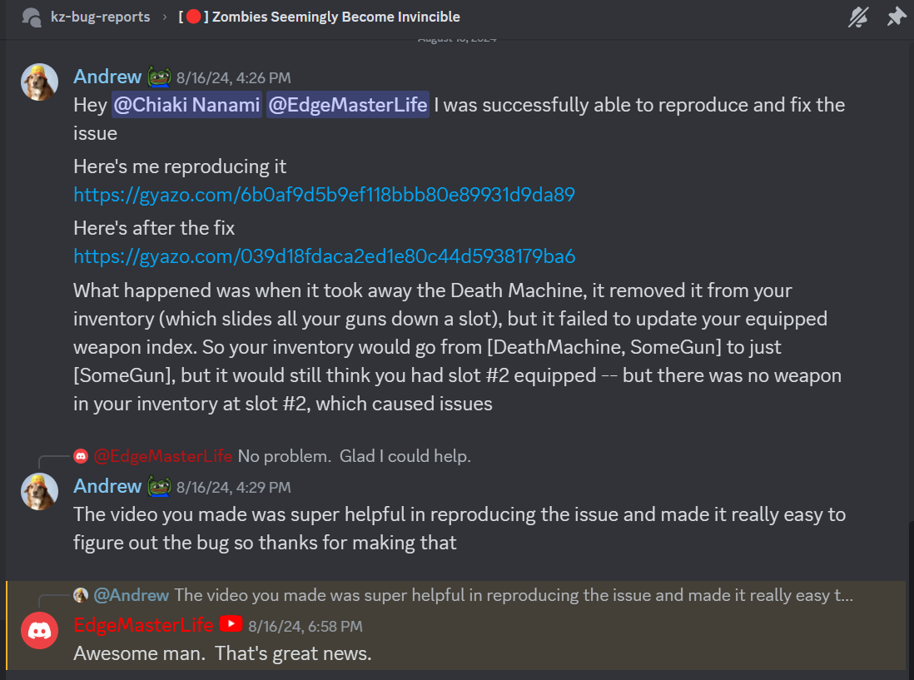
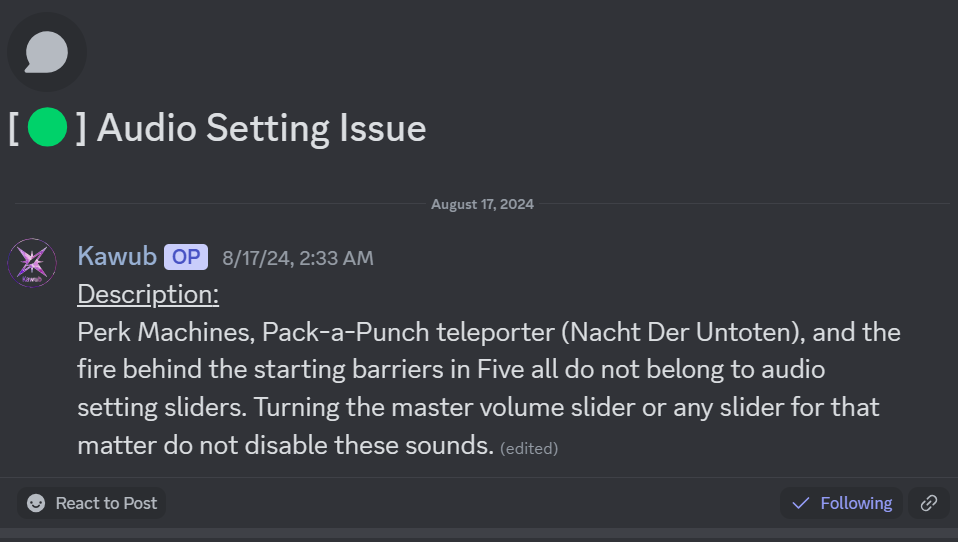
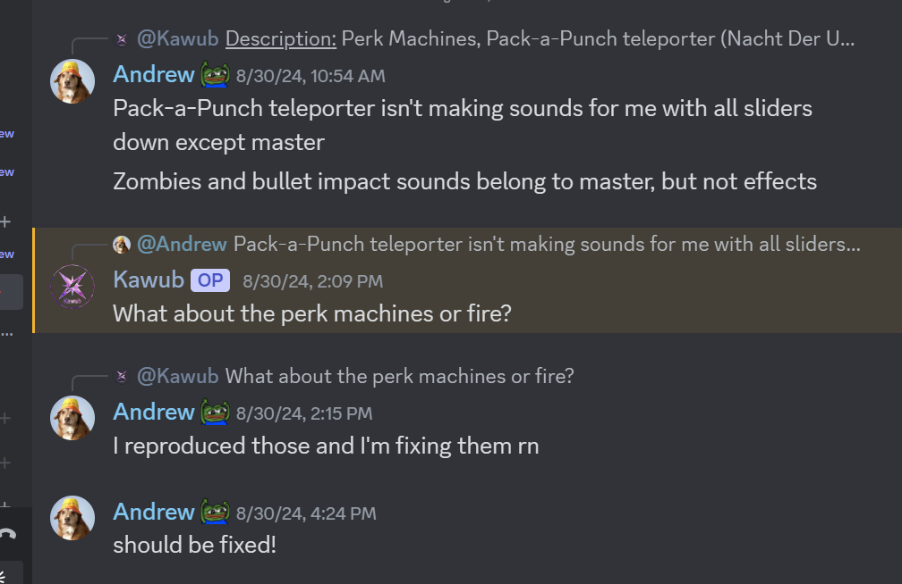
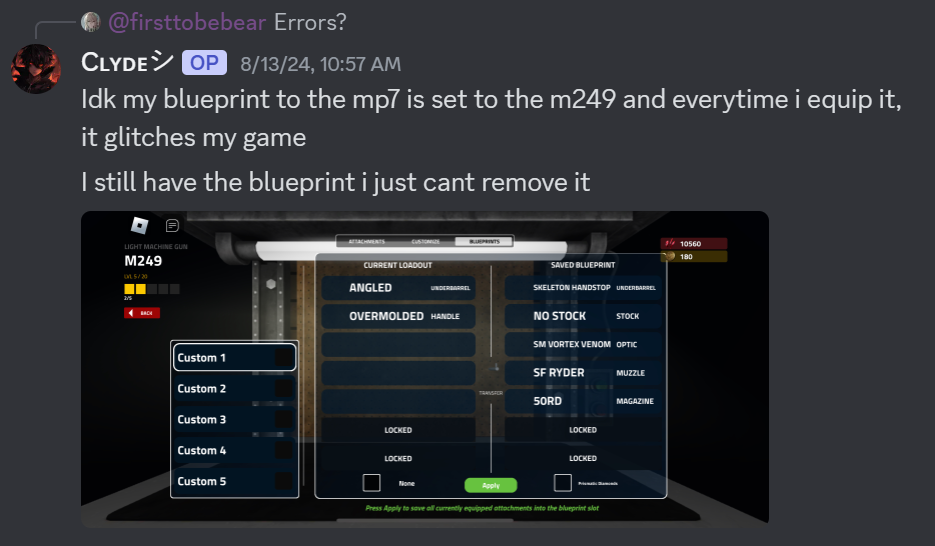
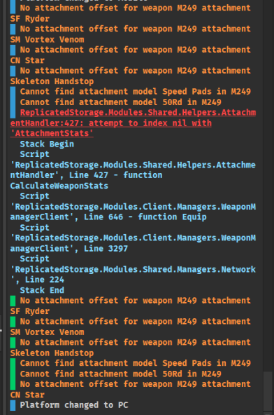
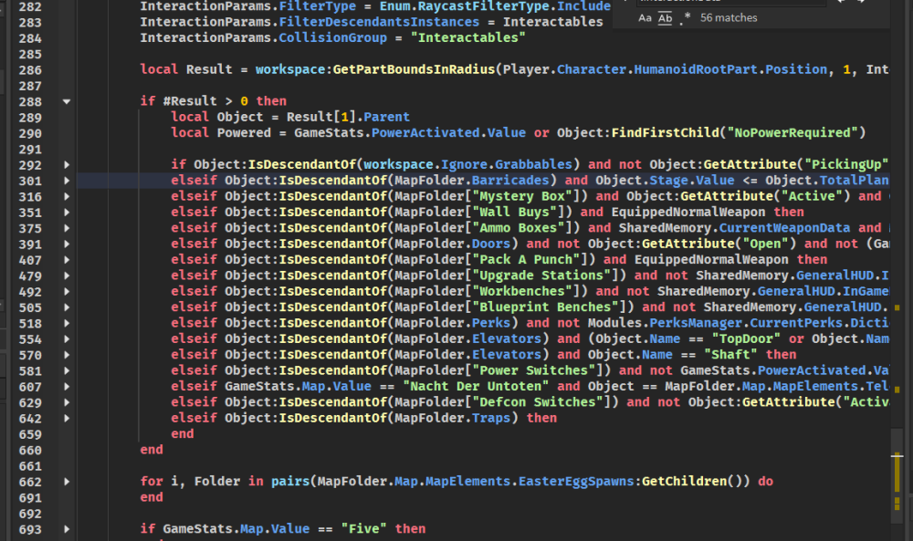
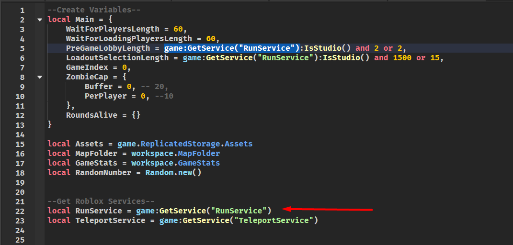
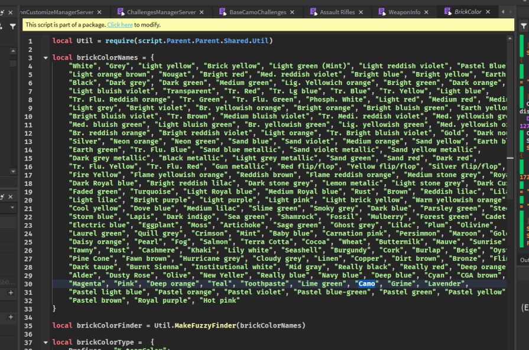
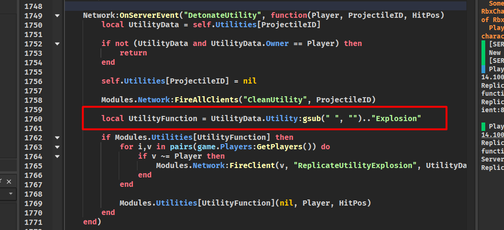
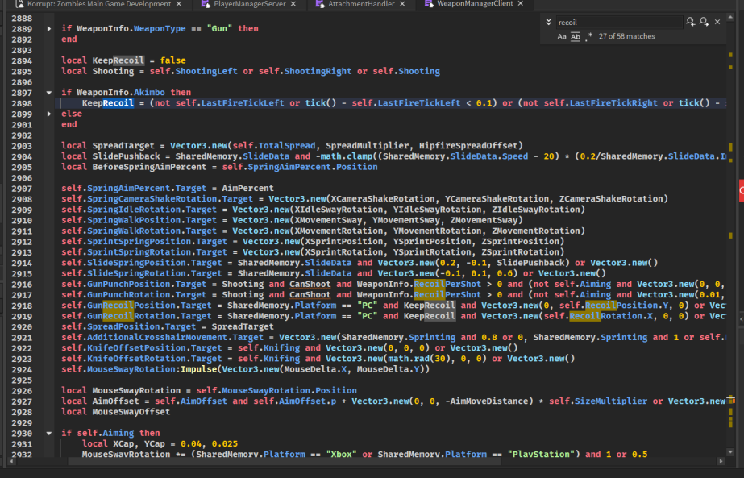

I worked for [Korrupt Zombies](https://www.roblox.com/games/10975855395) from July 2024 to November 2024. I was originally brought on to fix bugs, then I did some refactoring of the system, and then I started adding features for the Town map. Here are some gifs.

# Some features for the 'Town' map

For the Town map, I had to program lava mechanics: zombies and players catch fire when they stand on lava, and flaming zombies explode when shot.

The first explosion effects I used were the same as the grenade explosion effects, until one of the artists on the team gave me a simpler explosion effect to use.

I also gave flaming zombies a 1/100 chance to explode as a molotov, which spills fire all over the ground.

Players take damage when standing on lava, and have a blur effect to show heat and damage effects on their screen.

Here is a gif of me testing the bowling alley easter egg: when players shoot all of the bowling pins, it plays a strike animation on the screen overhead.

# Some of the bugs I fixed

I fixed around 30 player-reported bugs during my time with Korrupt Zombies. Here are some examples of the kinds of bugs I was working on:

## Famous zombie invincibility bug

There was a really specific case where guns would fail to damage zombies due to an error on the server. A player made a YouTube video about it:

<iframe width="914" height="514" src="https://www.youtube.com/embed/rQbXL5dU9lI" title="Korrupt Zombies: Zombie Invincibility Bug Hunt" frameborder="0" allow="accelerometer; autoplay; clipboard-write; encrypted-media; gyroscope; picture-in-picture; web-share" referrerpolicy="strict-origin-when-cross-origin" allowfullscreen></iframe>

Thanks to the video, I was able to reproduce the bug...

...and fix it.

The issue was actually pretty simple: when the game removed the Death Machine powerup (which is a gun in your inventory), it slides all of your inventory weapons down by one. However, it didn't update the 'equipped slot index' (a number pointing to the equipped gun slot), so it would throw an error when it thought you were trying to use a supposedly empty slot.

## Some sounds weren't adjustable via sound settings in the menu

The sounds reported here are all ambient sounds that were originally playing on the server. To fix this, I had to refactor the sound system so that ambient sounds were played on the client instead of the server, which required a system to replicate all of those sounds to the client when they loaded the game. 

I also modified the original API on the server to throw an error if you tried to play sounds on the server, so that future developers won't make the same mistake.

(I don't have a gif of the fix since it was an audio issue)

## Issues with 'blueprints'

Korrupt Zombies allows you to create loadouts, and for each loadout you can create different 'blueprints', which is a set of attachments that you can put on your gun during the middle of the game at the workbench in each of the maps.

There was an issue where, somehow, in certain circumstances (that we never figured out how to reproduce), you could put attachments in a blueprint that were not compatible with that gun. Then, when you applied that blueprint to your gun in-game, your gun model would vanish and your game would break.

This is what it looked like:

There was an error message, fortunately.

I never did figure out what caused the creation of bad blueprints -- partially because I couldn't reproduce it, and partially because the database backend was so vast and disorganized.

So instead, I implemented a partial solution, where the blueprints system just ignores any bad attachments and applies the rest:

# What I learned working for Korrupt Zombies

Korrupt Zombies is essentially a remake of Call of Duty: Zombies on ROBLOX. It went through a year of development, which included participating in the Roforco games accelerator program, and then it launched with a good deal of success. Then the original programmer of the game did an internship for the summer of 2024, and the project lost steam.

As of writing this, the project ownership has shifted and new people are setting the direction of development.

There are a couple of things I would like to note about this situation:

## 1. The most difficult part of working on Korrupt Zombies is the code: it is a mess.

Here are some examples:

I *do* prefer spagetti code to abstraction hell, because with Korrupt Zombies, if I ever wanted to repeat something that had been programmed before, all I had to do was copy-paste some line of code. But, the entire codebase shared basically the same scope, which means that any module can depend on any other code module in the game (you may have noticed that there are no module dependencies at the top of the file -- all modules are imported and called inline).

I actually tried looking for some underlying order to the chaos by rendering the dependency graph with a couple of different techniques.

